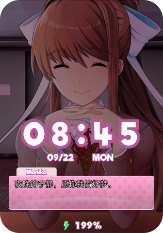

# 莫妮卡

将《心跳文学部》的莫妮卡带到小米手环上陪伴你！

## 功能特性

- ✅ **自然眨眼效果** - 每7～10秒自动眨眼一次
- ✅ **暗色模式支持** - 自动切换日/夜间主题
- ✅ **交互功能** - 触摸头部触发互动反应
- ✅ **智能问候** - 根据不同时间段显示开屏问候（上午、下午、晚上）
- ✅ **丰富对话** - 内置21条AI生成的对话内容
- ✅ **隐藏彩蛋** - 0.1%概率触发魔术脸特效
- ❌ **健康数据集成** - 结合步数、心率等数据的情景对话（8Pro字体原因暂时无法实现）

## 效果预览

<div style="display: flex; flex-wrap: wrap; gap: 10px; justify-content: center;">    </div>

## 快速开始

### 环境要求

- 支持Lua表盘的小米手环
- EasyFace表盘打包工具

### 安装步骤

1. 下载并安装 [EasyFace工具](https://github.com/m0tral/EasyFace)
2. 克隆或下载本项目代码
3. 使用EasyFace打开 `monika.fprj` 项目文件
4. 连接手环并打包安装表盘

### 下载地址

- GitHub: [https://github.com/m0tral/EasyFace](https://github.com/m0tral/EasyFace)
- 米坛社区: [https://www.bandbbs.cn/resources/2357/](https://www.bandbbs.cn/resources/2357/)

## 项目结构

```
monika/
├── LICENSE
├── README.md
├── app/
│   └── _lua/
│       └── monika/          # 核心代码与资源
├── images/                  # 预览图片
│   ├── 1.png
│   ├── 2.png
│   └── preview.png
├── monika.fprj             # EasyFace项目文件
└── 附加条款.md             # 许可证补充说明
```

### 核心文件说明

`app/_lua/monika/` 目录包含以下重要文件：

- **图片资源** (`.bin`文件) - LVGL格式的二进制图像
- **monika.lua** - 主程序逻辑

#### 图片资源分类

**必需资源：**
- `0.bin` ~ `9.bin`, `num_gang.bin` - 大数字显示 (54×64px)
- `num0.bin` ~ `num9.bin`, `num_%.bin`, `num_mao.bin` - 小数字显示 (20×24px)
- `mon.bin` ~ `sun.bin` - 星期指示图标 (48×20px)
- `bg.bin` - 背景图片 (设备分辨率)
- `msg.bin` - 对话框素材 (设备分辨率)
- 小米手环8Pro中还额外需要`text`目录中的文本进行代替

**可选资源：**
- `smile.bin`, `eye_close.bin`, `scare.bin` - 特殊表情效果
- `*_n.bin` - 夜间模式专用素材
- `ap.bin` - 电量指示图标 (22×22px)

> 所有 `.bin` 图片文件均可使用PNG格式替代，EasyFace支持自动转换。
> 且图片尺寸大小并不需要严格限死，但仍需保证像正常表盘开发一样的图片尺寸一致的规范

## 开发指南

### 自定义修改

本项目基于Luavgl开发，代码结构清晰易于理解：

1. **修改对话内容** - 编辑 `totalText` 数组和 `return_text()` 函数中的对话选项
2. **调整界面布局** - 修改 `t.objImage` 到 `t.text` 部分的坐标和资源路径
3. **自定义电量显示** - 调整 `systemStatusBattery` 事件处理中的布局逻辑

### 最佳实践

1. **设计先行** - 使用Figma、即时设计或MasterGo等工具预先设计界面
2. **逐步实现** - 按照容器坐标逐个元素实现布局
3. **测试验证** - 在真机上频繁测试确保兼容性

## 许可证

本项目采用 **GPL v3 许可证**并附加中文补充条款，详细内容请参阅：
- [LICENSE](LICENSE) -  GNU通用公共许可证v3
- [附加条款.md](附加条款.md) - 中文补充说明

---

希望本项目能帮助您学习表盘开发，为小米手环生态增添更多精彩内容！